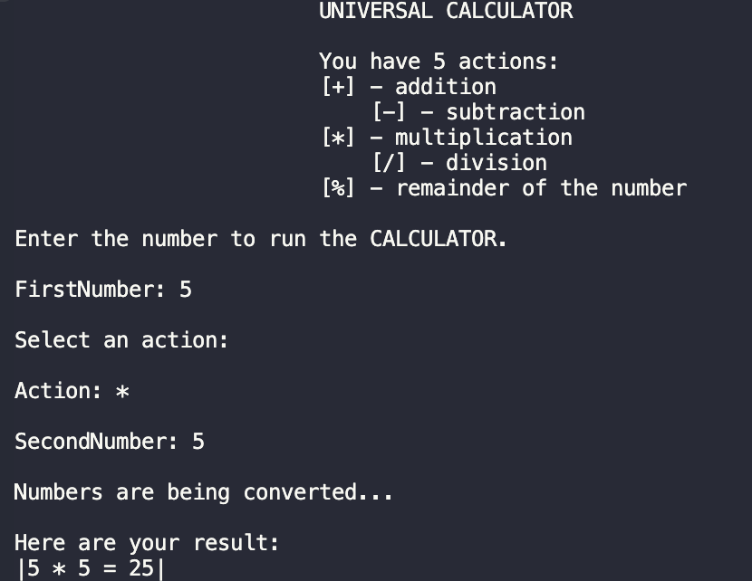
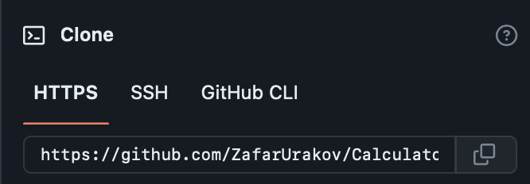

# NewCalculator

Calculator - is a development for working with arithmetic operations such as:
* Addition [+].
* Subtraction [-].
* Mupltiplication [*].
* Division [/].
* Remainder Calculation [%].

#### Types
```C#
double & string & char
```
#### Operators:
```C#
switch
```
The ***switch*** statement provides multidirectional branching in the program.

#### Functions
```C#
Output to console: Console.WriteLine();
Intput from console: Console.ReadLine();
Converts: Convert.ToDouble();
```
* Also in the code i used ***Escape Characters*** - replacement of control characters in the text with corresponding text substitutions.
Read more , [link](https://codebuns.com/csharp-basics/escape-sequences/).

#### Demo



If you want to see the old version , follow the [link](https://github.com/ZafarUrakov/NewCalculator/tree/releases/v2.0) !


#### If you want to take the code for yourself (***clone the repository*** ) , then you need to:
1.About the list of files,click <> Code.


2.Copy the URL(HTTPS) of the repository.




3.Open terminal.

4.Change the current working catalogue ti the location where the cloned catalogur should be located.

5.Type "***git clone***" and paste the URL copied earlier.


6.Press enter to create a local clone.


To see other projects click [HERE](https://github.com/ZafarUrakov).
