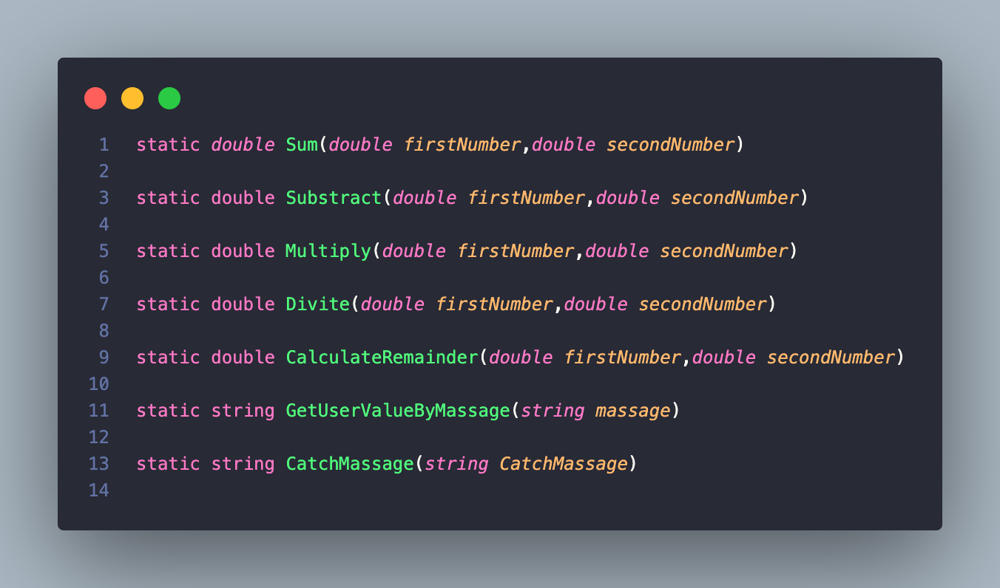

# Calculator and Multiplication table.

Calculator - is a development for working with arithmetic operations such as:
#### I used arithmetic operations like:
```C#
< + > - addition
< - > - subtraction
< * > - multiplication
< * > - division
< % > - remainde of the number
```
Multiplication is the process of calculating the product of two or more numbers.
```C#
1 * 1 = 1
1 * 2 = 2
1 * 3 = 3
...
```

#### Types
```C#
int & double & string & char
```
#### Functions:
```C#
Output to console: Console.WriteLine();
Intput from console: Console.ReadLine();
Converts: Convert.ToDouble();
```
#### Operators:
```C#
switch
```
The ***switch*** statement provides multidirectional branching in the program.


```C#
if(){...}
else{...}
```

The ***if-else*** construct is able to check one or more conditions, and if the condition is not true, then execute another code or check another condition.

```C#
while(){...}
for(){...}
```
Loops can execute a block of code as long as a specified condition is reached.

Loops are handy because they save time, reduce errors, and they make code more readable.

The ***while*** loop loops through a block of code as long as a specified condition is True:
```C#
while (condition) 
{
  // code block to be executed
}
```


When you know exactly how many times you want to loop through a block of code, use the ***for*** loop instead of a ***while*** loop:
```C#
for (statement 1; statement 2; statement 3) 
{
  // code block to be executed
}
```


**Statement 1** is executed (one time) before the execution of the code block.

**Statement 2** defines the condition for executing the code block.

**Statement 3** is executed (every time) after the code block has been executed.

```C#
try{...}
catch(){...}
```


```C#
Methods
static void Name(){...}
```



Also in the code i used ***Escape Characters*** - replacement of control characters in the text with corresponding text substitutions.
Read more, [link](https://codebuns.com/csharp-basics/escape-sequences/).

#### Demo


## Release Notes
In the [old](https://github.com/ZafarUrakov/NewCalculator/tree/releases/v3.0) version , we used arithmetic operations with ***input*** and ***output*** to the console.
We also used logical operators ***if-else***, ***try***-***catch*** and ***for-loop*** operations.

As for this version , you may notice changes in the code like:

- Added methods.
- Simplified the code.
- Fixed the errors.

Quickly go and try to use.

You can take my code and try it yourself 👇🏻

1.About the list of files,click <> Code.


2.Copy the URL(HTTPS) of the repository.


3.Open terminal.

4.Change the current working catalogue ti the location where the cloned catalogur should be located.

5.Type "***git clone***" and paste the URL copied earlier.


6.Press enter to create a local clone.


To see other projects click [HERE](https://github.com/ZafarUrakov).